## **CAMPro Installation guide**

 **1. Install CAMPro**

* [**1-1 Installation for Windows**](#1-1)
* [**1-2 Individual Machine Configuration**](#1-2)
* [**1-3 Multiple Machine Configuration**](#1-3) 

-------

**2. Run CAMPro**

* [**2-1 Run CAMPro**](#2-1)
* [**2-2 Log in CAMPro**](#2-2)
* [**2-3 Set DataBase**](#2-3)
* [**2-4 License Mechanism Explanation**](#2-4)

----

**3. How to update CAMPro**

* [**3-1 Update Version**](#3-1)
* [**3-2 Update License**](#3-2)

----

<h2 id="1-1"> 1-1 Installation for Windows </h2>

- Double click "**install.exe**". 

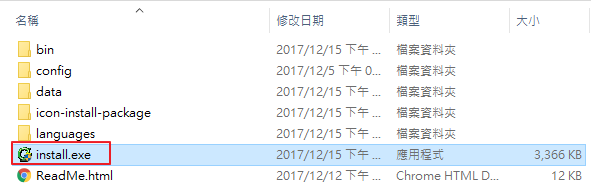

- Select language setting. (The demonstration takes English as an example)

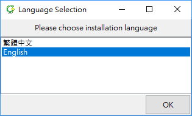

- Target Directory: Please choose Target Directory for CAMPro. (The demonstration takes C:\CAMPro as an example)
- Select "**First-Time Installation**".
- Click "**Next**".

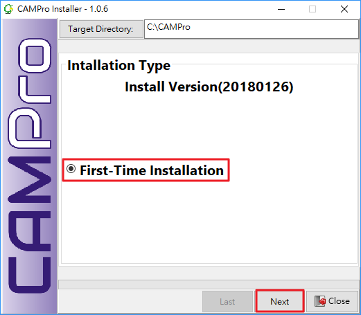

###Set Environment
- Choose Database Path (This will be the path where store your job data).
- Set your login account, the default setting is "g".
- Set your login password, the default setting is "g".
- Set CAMPro Server IP, Please refer [**1-2 Individual Machine Configuration**](#1-2) or [**1-3 Multiple Machine Configuration**](#1-3) depending on your configuration.
- Set Server Port, please key in 8090, 8890, 8080 or 8888. (The demonstration takes 8888  as an example)
- Please click "**Next**" once above settings are complete.

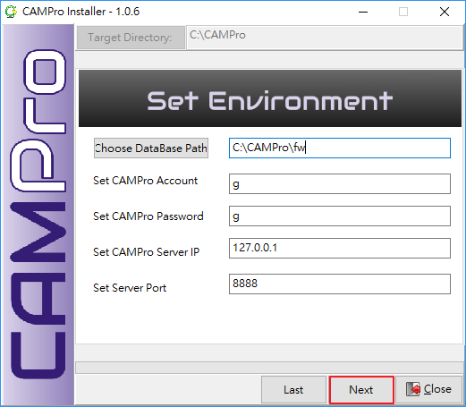

- Double check information in the window and click "**Install**".

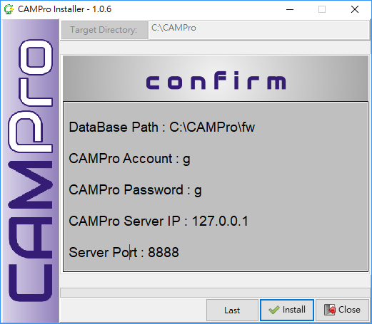

- Installation success.

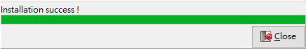

<h2 id="1-2"> 1-2 Individual Machine Configuration </h2>

- Choose Database Path (This will be the path where store your job data). (The demonstration takes C:/campro/fw as an example)
- Set your login account. The demonstration takes "g" as an example.
- Set your login password. The demonstration takes "g" as an example.
- Set CAMPro Server IP, you can key in the server IP that currently with the license key, "localhost" or "**127.0.0.1**”.  (The demonstration takes 127.0.0.1 as an example)
- Set CAMPro Server Port, you can key in 8090, 8890, 8080 or 8888. (The demonstration takes 8888 as an example)
   Note: **Server Port must be the same as the connected Server Port is set.**

<h2 id="1-3"> 1-3 Multiple Machine Configuration </h2>

- Choose Database Path (This will be the path where store your job data). (The demonstration takes C:/campro/fw as an example)
- Set your login account. (The demonstration takes g as an example)
- Set your login password. (The demonstration takes g as an example)
- Set CAMPro Server IP, **please key in Server IP that you would like to connect**.
- Set CAMPro Server Port, you can key in 8090, 8890, 8080 or 8888. (The demonstration takes 8888 as an example)
 Note: **Server Port must be the same as the connected Server Port is set.**

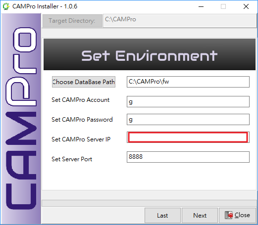

<h2 id="2-1"> 2-1 Run CAMPro </h2>

- Insert USB License Key on your computer. 
- Open Path C:\campro\1.1.
- Run **ezServer.exe** in advance and make sure the server you are connecting is working. After confirming ezServer runs well, please double click **camPro.exe** so that you can start to use camPro!

<h2 id="2-2"> 2-2 Log in CAMPro </h2>

- Key in Login Name : g
- Key in Password : g
- The demonstration takes Default settings that are both g for example.
- Click "**Login**".

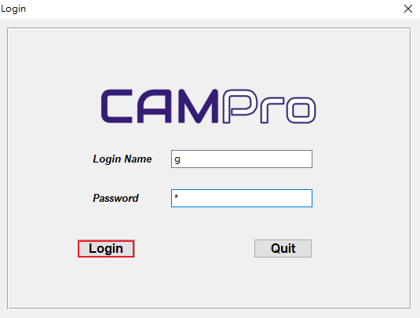

- CAMPro allows you to change username and password afterward by click **Options>Users**.

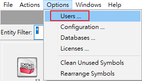

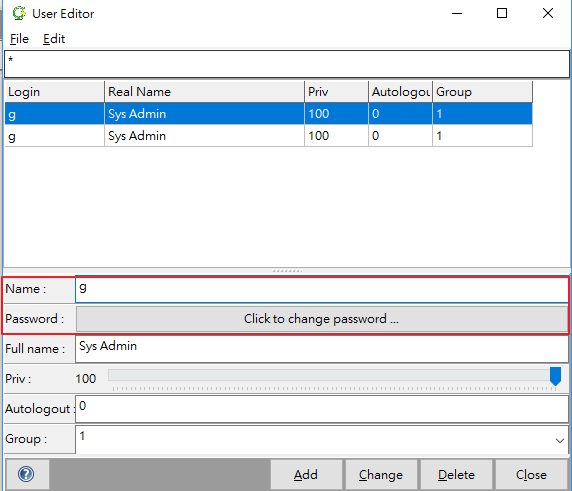

<h2 id="2-3"> 2-3 Set DataBase </h2>

- Generally, DataBase Path has been chosen in Set Environment Phrase.

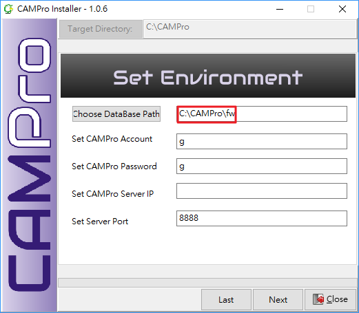

- CAMPro allows you to change Database Path afterward by clicking **Options>Databases>Change.**

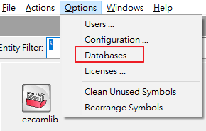

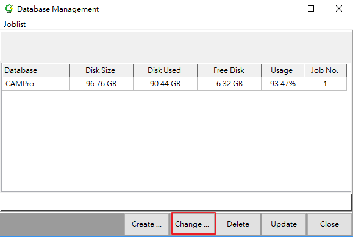

<h2 id="2-4"> 2-4 License Mechanism Explanation </h2>

- If you would like to check due date of your CamPro License, you can click **Options>License** to check the expired date.

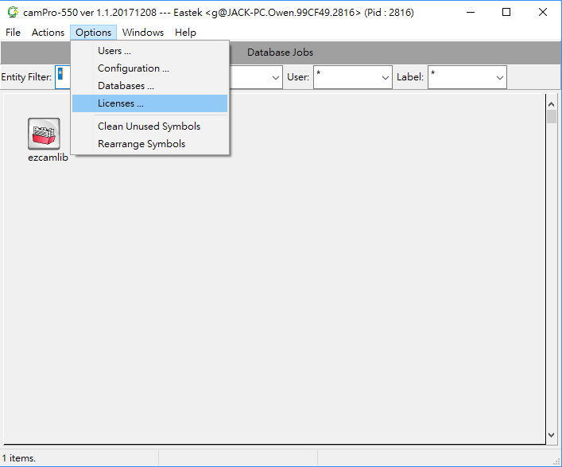

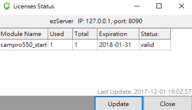

<h2 id="3-1"> 3-1 Update Version </h2>

###  Update by Installation Package：

- Click "**install.exe**".

- Target Directory: Directory where store CAMPro.
- Installation Type: Choose "**Version Update**".
- Click "**Updated**".

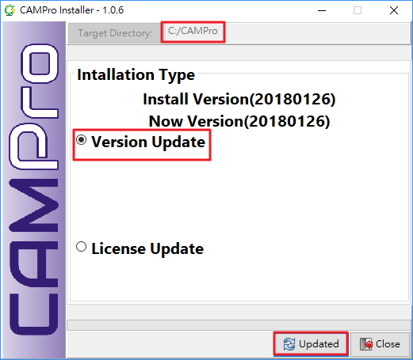

###Update Manually: 

- Let the new 1.1 folder be copied and be pasted in CAMPro folder in order to replace the previous 1.1 folder.

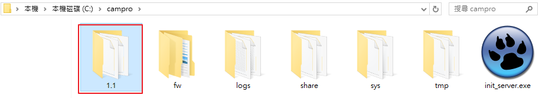

----------

<h2 id="3-2"> 3-2 Update License </h2>

###Update by Installation Package：

- Click "**install.exe**".

- Target Directory: Directory where store CAMPro.
- Installation Type: Choose "**License Update**".
- Click "**Updated**".

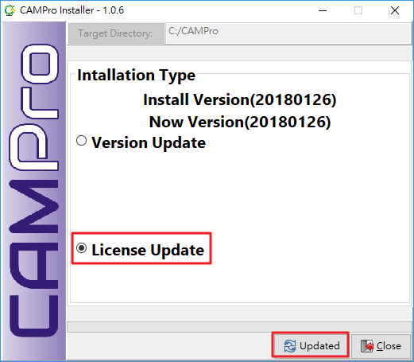

### Update Manually：
- Open C:\campro\share\license Path. 

- Let the new license file be copied and be pasted in license folder in order to replace the previous license.

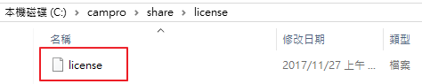

