## **CAMPro 資料讀取與匯出使用手冊**

**1. ODB++ 匯入與匯出**

* [**1-1 ODB++ 匯入**](#1-1) 
      * [1-1-1 一般匯入](#1-1-1) 
      * [1-1-2 拖曳匯入](#1-1-2)                                                 
   

* [**1-2 ODB++ 匯出**](#1-2)
       * [1-2-1 設定輸出規格](#1-2-1)  
       * [1-2-2 全部匯出](#1-2-2)  
       * [1-2-3 部分匯出](#1-2-3)  

----------
**2. 讀取 Gerber 檔案**

* [**2-1 讀取 Gerber274X 一般程序**](#2-1)
       * [2-1-1 創建 Entity](#2-1-1)
       * [2-1-2 一般讀取](#2-1-2)
       * [2-1-3 拖曳讀取](#2-1-3)
       * [2-1-4 分析與處理 Gerber274X](#2-1-4)
 
>

* [**2-2 讀取 Gerber274X 時發生異常時如何處理**](#2-2)
       * [2-2-1 如何修改 Gerber274X 參數](#2-2-1)
       * [2-2-2 重新 Translate Gerber274X](#2-2-2)
 
>

* [**2-3 讀取 Gerber274D 一般程序**](#2-3)
       * [2-3-1 創建 Entity](#2-3-1)
       * [2-3-2 一般讀取](#2-3-2)
       * [2-3-3 拖曳讀取](#2-3-3)
       * [2-3-4 分析與處理 Gerber274D](#2-3-4)				
        
>

* [**2-4 讀取 Gerber274D 時發生異常時如何處理**](#2-4)
       * [2-4-1 找出與 Gerber274D 對應的 Ascii 檔案](#2-4-1)
       * [2-4-2 開啟 Wheel Template Editor Form](#2-4-2)
       * [2-4-3 修改 Wheel Template Editor Form](#2-4-3)   
           * [2-4-3-1 修改參數](#2-4-3-1)
           * [2-4-3-2 設定形狀](#2-4-3-2)                                        
           * [2-4-3-3 設定 Dcode](#2-4-3-3)
           * [2-4-3-4 設定 X,Y Size](#2-4-3-4)                                     
           * [2-4-3-5 Translate Wheel](#2-4-3-5)
       * [2-4-4 圖形不明時如何處理](#2-4-4)        
       * [2-4-5 沒有圖形時如何處理](#2-4-5)
       * [2-4-6 X 或 Y 軸 Size 未提供時如何處理](#2-4-6)
       * [2-4-7 儲存設定完成的 Wheel Template](#2-4-7)
       * [2-4-8 讀取設定完成的 Wheel Template](#2-4-8)
       * [2-4-9 重新 Translate Gerber274D](#2-4-9)
 
>

--------

**3. 讀取 Excellon2 檔案**

* [**3-1 讀取 Excellon2 一般程序**](#3-1) 
       * [3-1-1 創建 Entity](#3-1-1)
       * [3-1-2 一般讀取](#3-1-2)
       * [3-1-3 拖曳讀取](#3-1-3)
       * [3-1-4 分析與處理 Excellon2](#3-1-4)
        
>

* [**3-2 讀取 Excellon2 時發生異常時如何處理**](#3-2) 
       * [3-2-1 分割鑽孔 Ascii 文件](#3-2-1)
       * [3-2-2 開啟 Wheel Template Editor Form](#3-2-2)
       * [3-2-3 修改參數](#3-2-3)
       * [3-2-4 設定形狀](#3-2-4)
       * [3-2-5 設定 Dcode](#3-2-5)
       * [3-2-6 設定尺寸](#3-2-6)
       * [3-2-7 Translate Wheel](#3-2-7)
       * [3-2-8 實作範例延續](#3-2-8)
       * [3-2-9 儲存設定完成的 Wheel Template](#3-2-9)
       * [3-2-10 讀取設定完成的 Wheel Template](#3-2-10)
       * [3-2-11 重新 Translate Excellon2](#3-2-11)
   

--------------------

**4. 讀取 DXF 檔案**

* [**4-1 讀取 DXF 一般程序**](#4-1)
       * [4-1-1 創建 Entity](#4-1-1)
       * [4-1-2 一般讀取](#4-1-2)
       * [4-1-3 拖曳讀取](#4-1-3)
       * [4-1-4 分析與處理 DXF](#4-1-4)
 
>

* [**4-2 讀取 DXF 時發生異常時如何處理**](#4-2)
       * [4-2-1 如何修正 DXF 參數](#4-2-1)
       * [4-2-2 重新 Translate DXF](#4-2-2)
 
>

----------------------

**5. 匯出 Gerber274X、Excellon2 或 DXF 檔案**

* [**5-1 匯出 Gerber274X**](#5-1)
       * [5-1-1 如何開啟 Output Package 視窗](#5-1-1)
       * [5-1-2 選擇需要 Output 的 Job](#5-1-2)
       * [5-1-3 選擇需要 Output 的 Step](#5-1-3)
       * [5-1-4 設定 Output 格式](#5-1-4)
       * [5-1-5 選擇需要 Output 的 Layer](#5-1-5)
       * [5-1-6 設定參數](#5-1-6)
       * [5-1-7 儲存參數設定](#5-1-7)
       * [5-1-8 選擇 Output 路徑](#5-1-8)
       * [5-1-9 命名 Gerber274X 檔案](#5-1-9)
       * [5-1-10 選擇定位點](#5-1-10)
       * [5-1-11 Output Gerber274X 完成](#5-1-11)
 
>

* [**5-2 匯出 Excellon2**](#5-2)
       * [5-2-1 如何開啟 Output Package 視窗](#5-2-1)
       * [5-2-2 選擇需要 Output 的 Job](#5-2-2)
       * [5-2-3 選擇需要 Output 的 Step](#5-2-3)
       * [5-2-4 設定 Output 格式](#5-2-4)
       * [5-2-5 選擇需要 Output 的 Layer](#5-2-5)
       * [5-2-6 設定參數](#5-2-6)
       * [5-2-7 儲存參數設定](#5-2-7)
       * [5-2-8 選擇 Output 路徑](#5-2-8)
       * [5-2-9 命名 Excellon2 檔案](#5-2-9)
       * [5-2-10 選擇定位點](#5-2-10)
       * [5-2-11 Output Excellon2 完成](#5-2-11)
 
>

* [**5-3 匯出 DXF**](#5-3)
       * [5-3-1 如何開啟 Output Package 視窗](#5-3-1)
       * [5-3-2 選擇需要 Output 的 Job](#5-3-2)
       * [5-3-3 選擇需要 Output 的 Step](#5-3-3)
       * [5-3-4 設定 Output 格式](#5-3-4)
       * [5-3-5 選擇需要 Output 的 Layer](#5-3-5)
       * [5-3-6 設定參數](#5-3-6)
       * [5-3-7 儲存參數設定](#5-3-7)
       * [5-3-8 選擇 Output 路徑](#5-3-8)
       * [5-3-9 命名 DXF 檔案](#5-3-9)
       * [5-3-10 選擇定位點](#5-3-10)
       * [5-3-11 Output DXF 完成](#5-3-11)

-----

<h2 id="1-1"> 1-1 ODB++ 匯入 </h2>

- 本章節將利用實際範例來說明如何匯入 ODB++。

### 匯入 ODB++ 有兩種方式：

<h4 id="1-1-1"> 1-1-1 一般匯入 </h4>

- 在 camPro 主畫面點開 "**File**"，然後點選 "**Import ODB++**"。

- 點選 "**Input Path**"。

 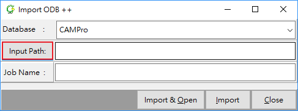

- 選取要匯入的 ODB++ 檔案。(本說明以 ODB++_demo.tgz 為例)

- 點選 "**Open**"。

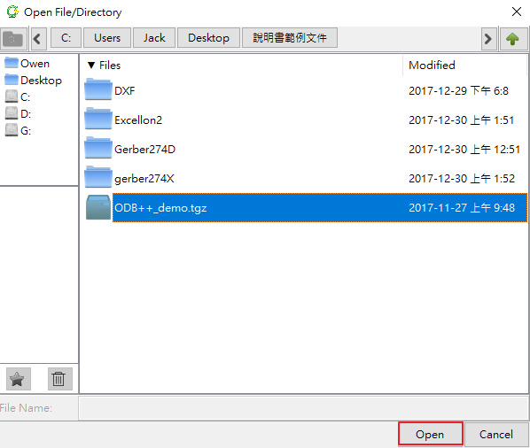

- 點選 "**Import**"。

- 匯入成功的料號會顯示在 camPro 主畫面。

<h4 id="1-1-2"> 1-1-2 拖曳匯入 </h4>

-  直接將 ODB++ 檔案 (通常副檔名為 .tgz) 拖曳到 camPro 主畫面。(本說明以 ODB++_demo.tgz 為例)

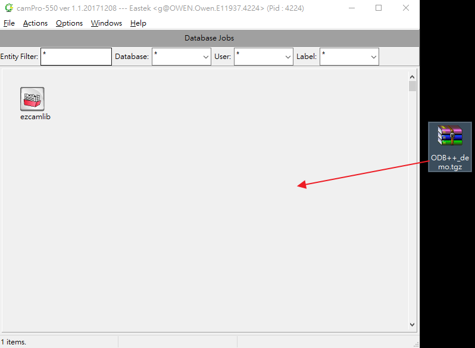

- 點選 "**Import**"。

- 匯入成功的料號會顯示在主畫面。

<h2 id="1-2"> 1-2 ODB++ 匯出 </h2>

- 本章節將利用實際範例來說明如何匯出 ODB++。

- 點選您要匯出的料號。

- 點開 "**File**"，選取 "**Export ODB++**"。

<h4 id="1-2-1"> 1-2-1 設定輸出規格 </h4>

- **Job**：即將匯出的料號。
- **Path**：匯出後的儲存的路徑，可自行選擇，說明以 C:/CAMPro 為例。
- **ODB++version**：選擇匯出版本，camPro 可支援版本 6 或 7 ，說明以版本 6 為例。

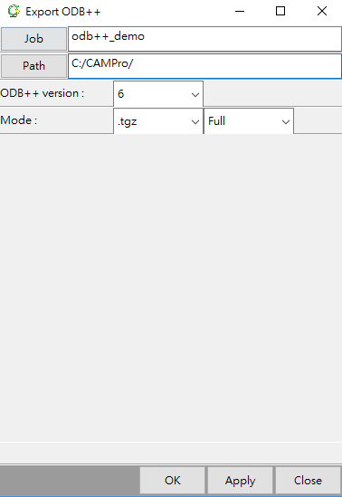

---

###Mode 分為兩種：

<h4 id="1-2-2"> 1-2-2 全部匯出 </h4>

- ODB++Version：可自行選擇版本 6 或 7 ，本說明以版本 6 為例。
- Mode：匯出副檔名系統自動預設值 "**.tgz**"，若要匯出全部檔案請選擇 "**Full**"。
- 設定完成後點選 "**Apply**"。
- 視窗下方出現綠底 Job export complete 通知後，即可至您指定的路徑找到匯出的 ODB++ 檔案!

<h4 id="1-2-3"> 1-2-3 部分匯出 </h4>

- 於 Mode 選取 "**Partial**" 可以從該料號中選擇部分資料進行匯出。

- 點開 "**Step**"，選擇需要匯出的 Step 然後點選 "**OK**"，說明以匯出 org 為例。

- 點開 "**Layer**"，選擇需要匯出的 Step 然後點選 "**OK**"，說明以匯出 stupy 為例。

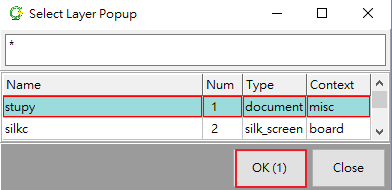

- 設定完成後點選 "**Apply**"。
- 視窗下方出現綠底 Job export complete 通知後，即可至您指定的路徑找到匯出的 ODB++ 檔案！

<h2 id="2-1"> 2-1 讀取 Gerber274X 一般程序 </h2>

- 本章節將利用實際範例來說明讀取 Gerber274X 的一般程序。

<h4 id="2-1-1"> 2-1-1 創建 Entity </h4>

- 先點開 "**File**"，再點選 "**Create**"。

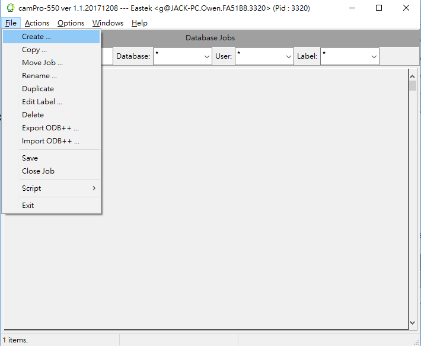

- Entity name：輸入 Entity 名稱(通常為料號)。
- Database：選取 Entity 存放的位置。
- 設定完後請點選 "**OK**"。

- 確認通知也點選 "**OK**"。

- 完成後 Entity 會出現在 camPro 主畫面上。

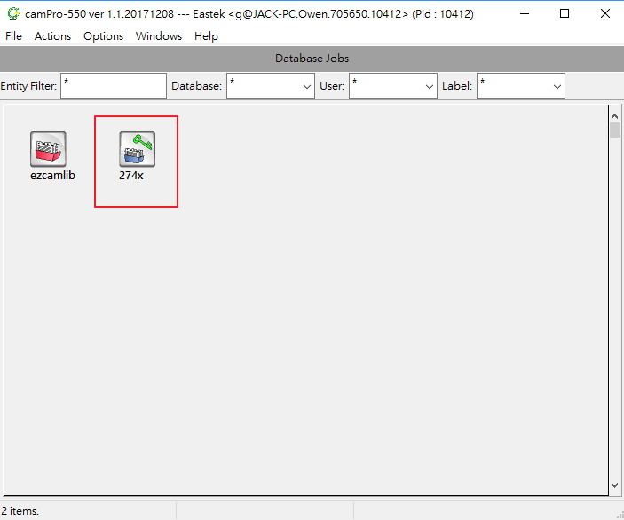

- 先點選您要匯入 Gerber274X 的 Entity，進入 Input package 畫面後點選 "**Input**"。

### 讀取 Gerber274X 有兩種方式：

<h4 id="2-1-2"> 2-1-2 一般讀取 </h4>

- 點選 "**Path**"，然後選擇您要讀取的 Gerber274X 檔案，之後點選 "**Open**"。

<h4 id="2-1-3"> 2-1-3 拖曳讀取 </h4>
- 將 Gerber274X 資料夾直接拖曳到 camPro 視窗內。

<h4 id="2-1-4"> 2-1-4 分析與處理 Gerber274X </h4>

- 將 Gerber274X 讀取後會進入 Input package 畫面。

- 點擊 "**Identify**"，camPro 就會開始分析檔案類型。

 

- 分析完成檔案類型會顯示在視窗裡，並呈現可勾選狀態。
- 請輸入 Step 名稱在欄位裡，範例名稱以 org 為例。
- 請勾選要讀取的 Gerber274X 檔案後點選 "**Translate**"。

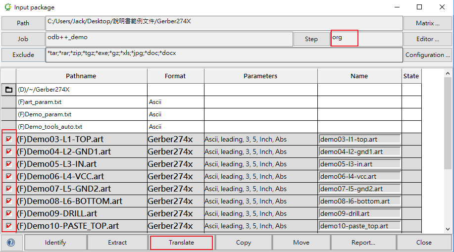

- 創建 Step 確認，點選 "**OK**"。

- Gerber274X 檔案經過 Translate 後 State 欄顯示 OK 即表示您的 Gerber274X 已經正常讀取。

- 接下來請點選 "**Editor**"，以檢閱您的讀取 Gerber274X 圖形顯示是否正確。

- 編輯圖形視窗範例：

<h2 id="2-2"> 2-2 讀取 Gerber274X 時發生異常時如何處理 </h2>

- 如果您發現您所讀取的 Gerber 圖形顯示不符合預期，本章節提供您一些解決方案。

<h4 id="2-2-1"> 2-2-1 如何修正 Gerber274x 參數 </h4>

- 如果遇到 Gerber 比例不正確時，請先勾選需要修正的 Gerber274x，然後再點右鍵，點選 "**Parameter**" 以修改參數。

- 依照您的需求修改參數設定。
- 更改 Number format。
- File Filter 提供快速讀取並帶入其它類似檔案的功能。
- 請於 Other File 選取 "**Yes**"。
- Format 選取 "**Same**"。
- Directory 選取 "**Same**"。
- 最後點選 "**OK**"。

<h4 id="2-2-2"> 2-2-2 重新 Translate Gerber274X </h4>

- 參數更改完成後請再次點選 "**Translate**"。
- 重新 Translate 後可以再點選 "**Editor**" 以再次檢閱圖形。

<h2 id="2-3"> 2-3 讀取 Gerber274D 一般程序 </h2>

- 本章節將利用實際範例來說明讀取 Gerber274D 的一般程序。

<h4 id="2-3-1"> 2-3-1 創建 Entity </h4>

- 先點開 "**File**"，點選 "**Create**"。

- Entity name：輸入 Entity 名稱(通常為料號)。說明以命名 274D 為例。
- Database：選擇 Entity 存放的位置。說明以預設值 Campro 資料夾為例。

- 以上設定完後請點選 "**OK**"，跳出的確認通知也點選 "**OK**"。

- 完成後 Entity 會出現在 camPro 主畫面上。

### 讀取 Gerber274D 有兩種方式：

<h4 id="2-3-2"> 2-3-2 一般讀取 </h4>

- 先點選您要讀取 Gerber274D 的 Entity，進入 Input package 畫面後點選 "**Input**"。

- 點選 "**Path**"，然後選擇您要讀取的 Gerber274D 檔案，之後點擊 "**Open**"

<h4 id="2-3-3"> 2-3-3 拖曳讀取 </h4>

- 直接將 Gerber274D 資料夾直接拖曳到 camPro 視窗內。

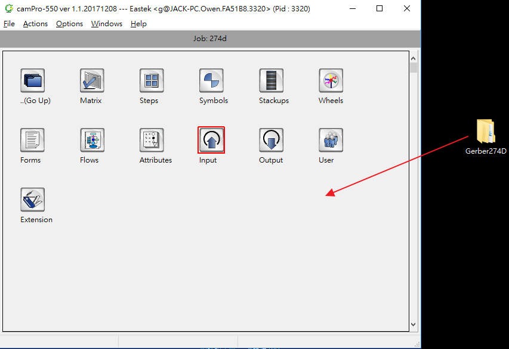

<h4 id="2-3-4"> 2-3-4 分析與處理 Gerber274D </h4>

- 點擊 "**Identify**"，camPro 會開始分析檔案類型。

 

- 分析完成檔案類型會顯示在 Input package 視窗裡，並呈現可勾選狀態。
- 請 **在 Step 欄位為它命名**，範例名稱以 "org" 為例。
- 請勾選要讀入的 Gerber 檔案後點選 "**Translate**"。

 

- 創建 Step 確認，點選 "**OK**"。

- Gerber 檔案經過 Translate 後 State 欄會顯示讀取後的結果。
- 如果 State 欄顯示 OK 並呈現綠底畫面，即表示該 Gerber274D 已經正常讀取。

- 接下來請點選 "**Editor**" 以檢閱您的 Gerber 圖形顯示是否正確。

- 編輯圖形視窗範例：

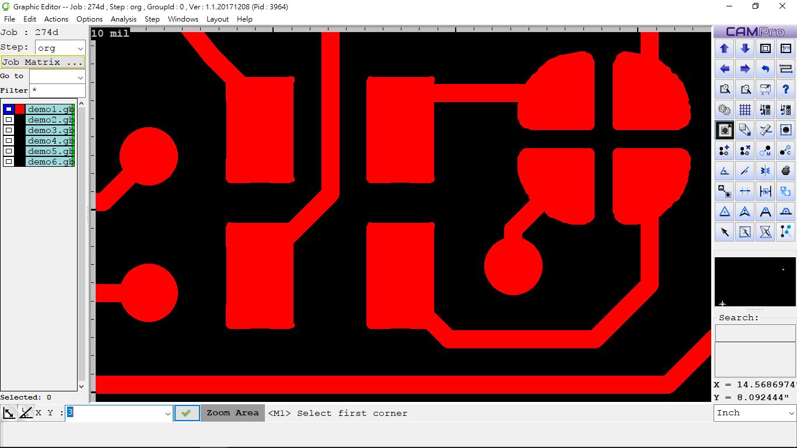

<h2 id="2-4"> 2-4 讀取 Gerber274D 時發生異常時如何處理 </h2>

- Gerber274D 檔案經過 Translate 後 State 欄會顯示讀取後結果，如果 State 欄出現 Check File，即代表該 Gerber274D 可能沒有被正常讀取，本章節將以實際範例教學來引導您如何修正它。

<h4 id="2-4-1"> 2-4-1 找出與 Gerber274D 對應的 Ascii 檔案 </h4>

- 可以點右鍵將 Ascii 檔案打開選 "**View Ascii**"，來判斷是不是與 Gerber274D 對應的 Ascii 檔案(通常檔案內說明會有 Dcode,Type 等關鍵字)。
- 本說明以 Demo.LST 為例。

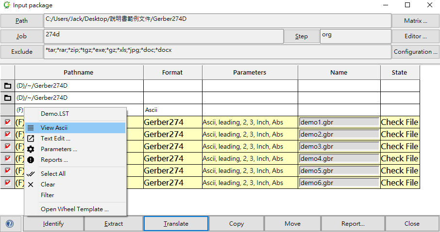

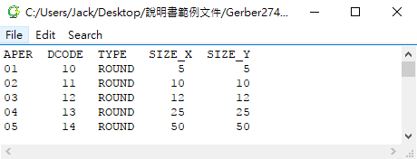

<h4 id="2-4-2"> 2-4-2 開啟 Wheel Template Editor Form </h4>

- 針對要修正的 Ascii 檔案點右鍵，點選 "**Open Wheel Template**"。
- 本說明以 Demo.LST 為例。

<h4 id="2-4-3"> 2-4-3 修改 Wheel Template Editor Form </h4>

- 請參考以下小章節以了解需要在 Wheel Template Editor Form 內設定的項目。

<h4 id="2-4-3-1"> 2-4-3-1 修改參數 </h4>

- 點開 "**Params**"，點選 **"Global**"。

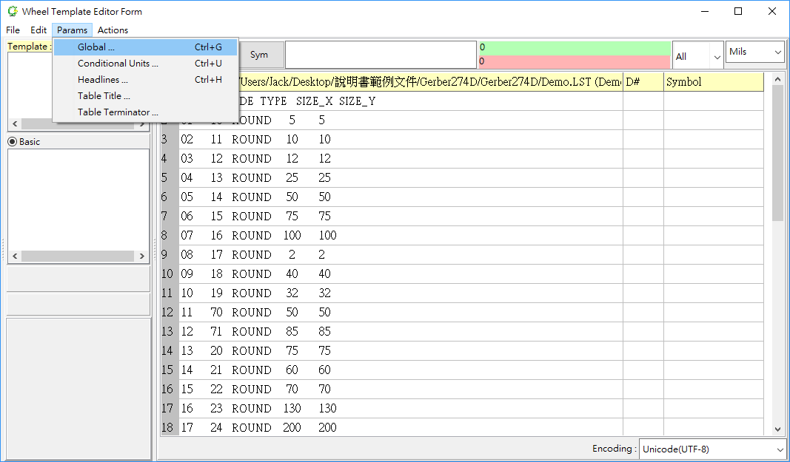

- Wheel type：因為此檔案為 Gerber274D 檔案，所以選擇 **Gerber**。
- Unit：依據您實際作業的 Size 做判斷，說明以選擇 **Mil** 為例。
- 點選 "**OK**"。

<h4 id="2-4-3-2"> 2-4-3-2 設定形狀 </h4>

- 點選 APER 編號 01 欄位。

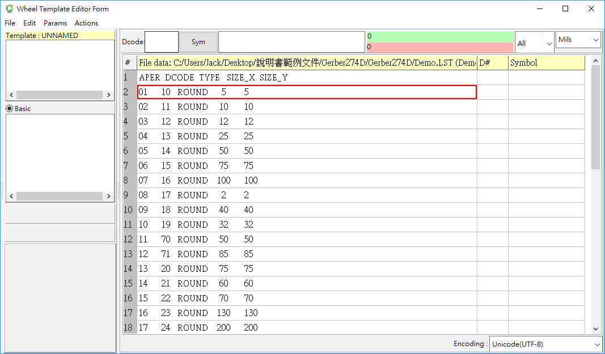

- 點開 "**Edit**" 選 "**Add Record**"，會跳出 Popup 視窗。

- 因為列表上是 ROUND，所以在 Popup 視窗選擇 "**ROUND**"，點選 "**OK**"。

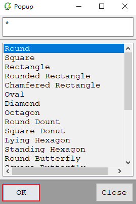

<h4 id="2-4-3-3"> 2-4-3-3 設定 Dcode </h4>

- 與左邊 Basic 欄框比對後找到與選取紅框內的 Dcode 相同的號碼。

- 將與紅框內和相同 Dcode 號碼的 Float 改為 "**Dcode**"。

<h4 id="2-4-3-4"> 2-4-3-4 設定 Size </h4>

- 與左邊 Basic 欄框比對後找到與紅框內的 Size_X 和 Size_Y 相同的數值，然後點選 "**Diameter**" 以帶入該數值。(由於範例是圓形，所以只需要改一邊 Size 即可)

<h4 id="2-4-3-5"> 2-4-3-5 Translate Wheel </h4>

- 將參數、形狀、Dcode、Size 都設置完成後，點開 "**Actions**" 然後點選 "**Translate Wheel**"。

- 成功轉換的欄位的會呈現綠底狀態，且 camPro 會找到與它相似條件的項目自動帶入。

#### 延續範例

- 因為是不同格式所以剩餘的項目未轉換成功，所以需要重複以上步驟再次設定形狀、設定 Dcode、Size，最後再 Translate Wheel。

##### 設定形狀

- 點選尚未轉換成功的第一個項目，本說明如下圖為 APER 18 欄位。
- 點開 "**Edit**" 選 "**Add Record**"，會跳出 Popup 視窗。

- 因為列表上是 "Square"，所以在 Popup 視窗選擇 "**Square**"，點選 "**OK**"。

#####設定 Dcode 與 Size

- 將與紅框內和相同 Dcode 號碼的 Float 改為 "Dcode"。(如果預設值就正確就可以不需要修改)

- 與左邊 Basic 欄框比對後找到與紅框內的 Size_X 和 Size_Y 相同的數值，然後點選 "**Size**"。

#####Translate Wheel

- 將參數、形狀、Dcode、Size 都設置完成後點開 "**Actions**"，然後點選 "**Translate Wheel**"。

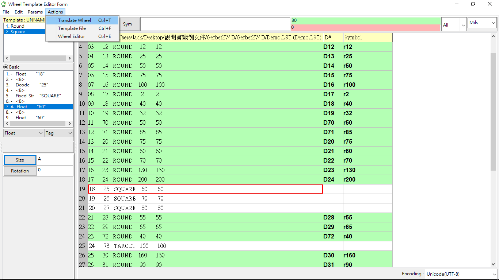

- 成功轉換的欄位的會呈現綠底黑字，camPro 會找到與它相似的條件自動帶入。

<h4 id="2-4-4"> 2-4-4 圖形不明時如何處理 </h4>

- 點選指定項目。(以紅框選取項目顯示 TARGET 為範例)

- 點開 "**Edit**" 選 "**Add Record**"。

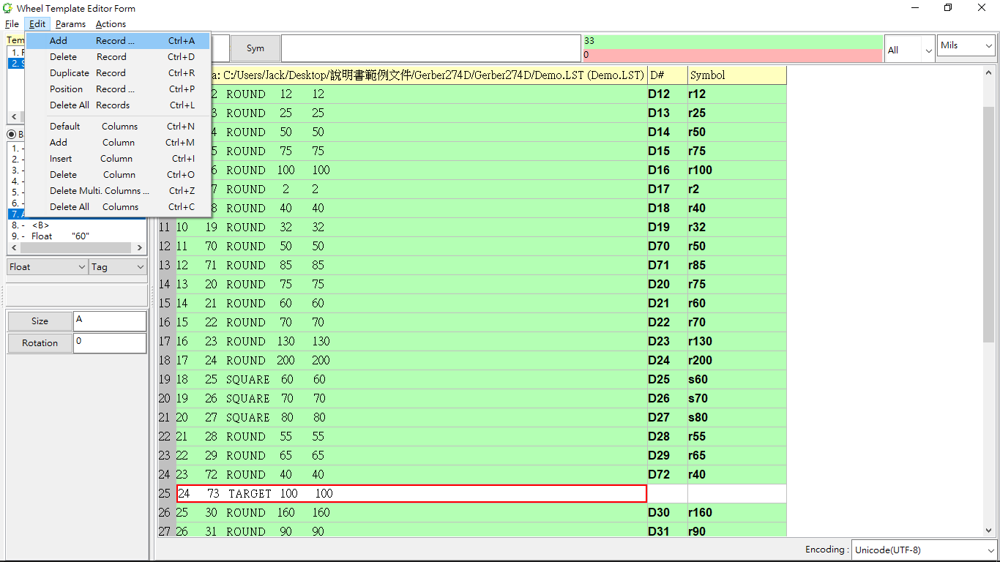

- 跳出的 Popup 視窗，選擇 "**Round**"，然後點選 "**OK**"。

 

- 與左邊 Basic 欄框比對後找到與紅框內的 Dcode 相同的號碼。
- 將與紅框內和相同 Dcode 號碼的 Float 改為 "**Dcode**"。(如果預設值就正確就可以不需要修改)
- 設定 Size：與左邊 Basic 欄框比對後找到與紅框內的 Size_X 和 Size_Y 相同的數值，然後點選 "**Diameter**"，系統即會帶入此預設值。

- 將形狀、Dcode、Size 等都設置完成後，點開 Actions 然後點選 "**Translate Wheel**"，該項目呈現綠底狀態即表示已順利帶入。

 

<h4 id="2-4-5"> 2-4-5 沒有圖形時如何處理 </h4>

- 點選指定項目 (說明以紅框選取項目顯示 ---- 為範例)。

- 點開 "**Edit**" 選 "**Add Record**"。

- 跳出的 Popup 視窗，選擇 "**Round**"，然後點選 "**OK**"。

- 與左邊 Basic 欄框比對後找到與紅框內的 Dcode 相同的號碼。
- 將與紅框內和相同 Dcode 號碼的 Float 改為 "**Dcode**"。(如果預設值就正確就可以不需要修改)
- 設定 Size：與左邊 Basic 欄框比對後找到與選取紅框內的 Size_X 和 Size_Y 相同的數值，然後點選 "**Diameter**"，系統即會帶入此預設值。

-  將形狀、Dcode、Size 等都設置完成後都設置完成後，點開 "**Actions**" 然後點選 "**Translate Wheel**"，該項目呈現綠底狀態即表示已順利帶入。

<h4 id="2-4-6"> 2-4-6  X 或 Y 軸的 Size 未提供時如何處理 </h4>

- 點選指定項目。

- 點開 "**Edit**" 選 "**Add Record**"。

- 跳出的 Popup 視窗，選擇 "**Round**"，然後點選 "**OK**"。

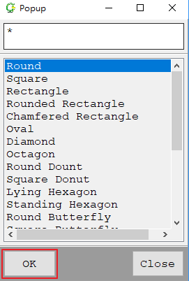

- 與左邊 Basic 欄框比對後找到與紅框內的 Dcode 相同的號碼。
- 將與紅框內和相同 Dcode 號碼的 Float 改為 "**Dcode**"。(如果預設值就正確就可以不需要修改)
- 設定 Size：與左邊 Basic 欄框比對後找到與紅框內的 Size_X 和 Size_Y 相同的數值，然後點選 "**Diameter**"，系統即會帶入此預設值。

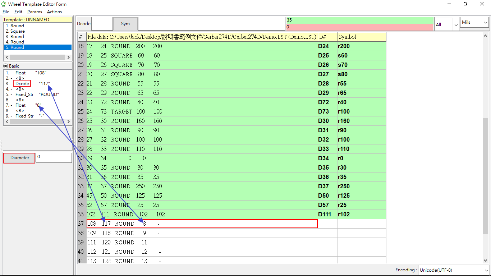

- 以上都設置完成後，點開 "**Actions**" 然後點選 "**Translate Wheel**"，該項目呈現綠底狀態即表示已順利帶入。

-------------------------

<h4 id="2-4-7"> 2-4-7  儲存設定完成的 Wheel Template </h4>

- 確認所有項目都已經設定形狀、Dcode、Size 後且皆為綠底狀態後，即可準備儲存 Wheel Template 檔。

- 點開 "**File**" 後點選 "**Save**" (或按快捷鍵 Ctrl+S )。
- 命名 Wheel Template，範例名稱以 "Demo" 為例。

<h4 id="2-4-8"> 2-4-8  讀取設定完成的 Wheel Template </h4>

#####▼ 回到 Input package 畫面

- 任選一個要匯入的 Gerber274D 檔按右鍵，點選 "**Parameters**"。
- 點選 "**Wheel**"，選擇剛剛修改的 Wheel 檔案，此範例即 Demo.LST，點選 "**OK**"。

* File Filter 提供快速讀取並帶入其它類似檔案的功能。
	* 請於 Other File 選取 "**Yes**"。
	* Format 選取 "**Same**"。
	* Directory 選取 "**Same**"。
	* 都設定完後請點選 "**OK**"。

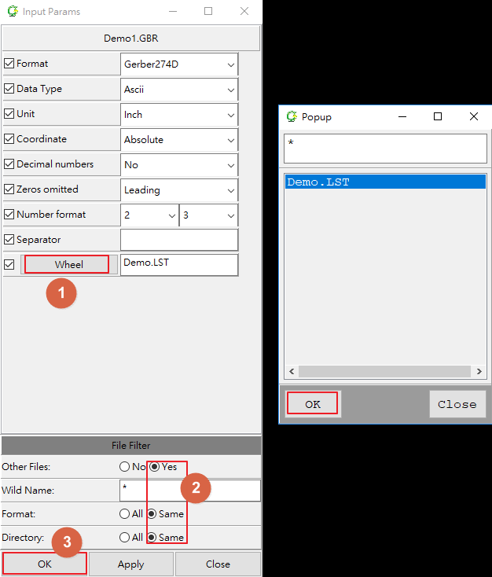

<h4 id="2-4-9"> 2-4-9  重新 Translate Gerber274D </h4>

- 勾選需要的 Gerber274D 項目。
- 先點選 "**Identify**"，後點選 "**Translate**" 以重新讀入修正 Wheel Template 後的 Gerber274D。

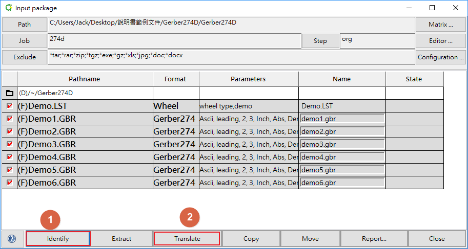

- 跳出的 Warning 視窗會詢問您是否覆蓋選取 Layers 之前的紀錄，這時請點選 "**OK**"。

- 剛才選取的 Gerber274D 檔經過執行 Translate 後會出現綠底狀態，State 欄位會顯示 OK。

- 最後在點選 "**Editor**" 進入編輯畫面檢查圖形是否正確讀入。

<h2 id="3-1"> 3-1 讀取 Excellon2 一般程序 </h2>

- 有關如何讀取 Excellon2 的一般程序請參閱以下實際操作說明。

<h4 id="3-1-1"> 3-1-1  創建 Entity </h4>

- 先點開 "**File**"，點選 "**Create**"。

- Entity name：輸入 Entity 名稱(通常為料號)。
- Database：選取 Entity 存放的位置。
- 設定完後請點選 "**OK**"。

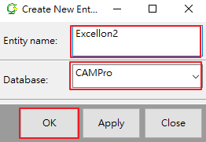

- 跳出的確認通知也點選 "**OK**"。

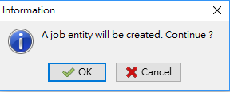

- 完成後 Entity 會出現在 camPro 主畫面上。

- 先點選您要匯入 Excellon2 的 Entity，進入 Input package 畫面後點選 "**Input**"。

####讀取 Excellon2 有兩種方式：

<h4 id="3-1-2"> 3-1-2  一般讀取 </h4>

- 點選 "**Path**"，然後點選您要讀取的 Excellon2 檔案，之後點擊 "**Open**"。

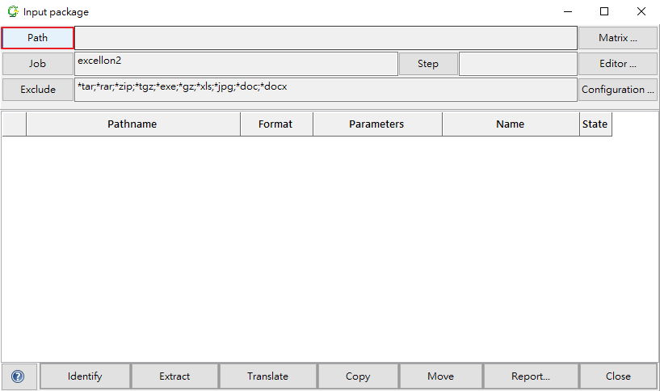

<h4 id="3-1-3"> 3-1-3  拖曳讀取 </h4>

- 將 Excellon2 資料夾直接拖曳到 camPro 視窗內。

<h4 id="3-1-4"> 3-1-4  分析與處理 Excellon2 </h4>

- 將 Excellon2 讀取後會進入 Input package 畫面。

- 點擊 "**Identify**"，camPro 就會開始分析檔案類型。

- 分析完成檔案類型會顯示在視窗裡，並呈現可勾選狀態，請輸入 Step 名稱在欄位裡，範例名稱以 org 為例。

- 請勾選要讀入的 Excellon2 檔案後點選 "**Translate**"。

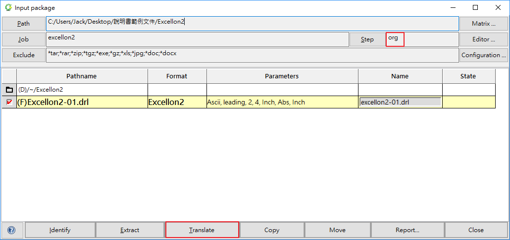

- 創建 Step 確認，點選 "**OK**"。

- Excellon2 檔案經過 Translate 後 State 欄顯示 OK 時，即表示您的 Excellon2 已正常讀取。

- 最後在點選 "**Editor**" 進入編輯畫面檢查圖形是否正確讀入。

 

<h2 id="3-2"> 3-2 讀取 Excellon2 時發生異常時如何處理 </h2>

- 當 Translate 選取的 Excellon2 項目之後 State 欄位顯示 Check File 時，有可能是有部分資料未被正常讀取，本章節將以實際操作來教導您解決方案。

<h4 id="3-2-1"> 3-2-1 分割鑽孔 Ascii 文件 </h4>

- 勾選您要修改的 Excellon2，然後點選 "**Extract**" 以分割文件。

<h4 id="3-2-2"> 3-2-2 開啟 Wheel Template Editor Form </h4>

- 分割文件後畫面會多出現一個 Ascii 格式的項目，請針對它按右鍵，點選 "**Open Wheel Template**"。 

<h4 id="3-2-3"> 3-2-3 修改參數 </h4>

- 打開 Wheel Template Editor Form 之後，點開 "**Params**"，點選 "**Global**"。

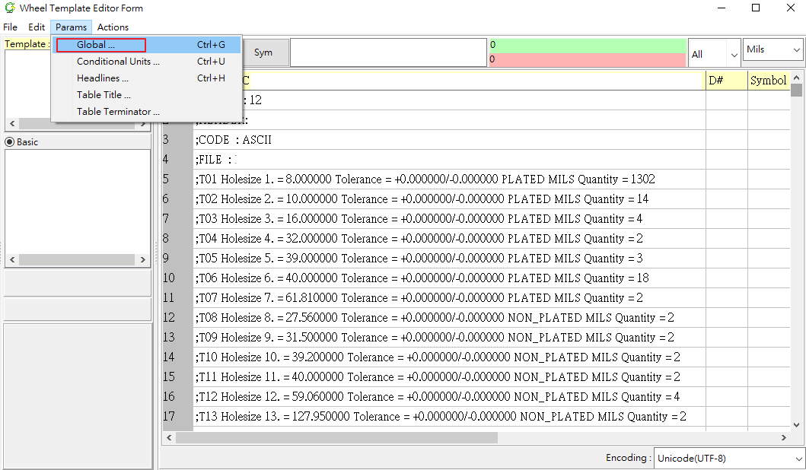

- 選擇 Wheel Type：**Tools**。
- 選擇 Unit：**Mil**。(依據來源尺寸自行判斷單位，說明以 Mil 為例)
- 完成後點選 "**OK**"。

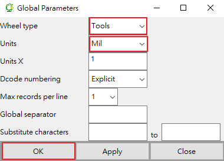

<h4 id="3-2-4"> 3-2-4 設定形狀 </h4>

- 點選第一支鑽孔項目。

- 點開 "**Edit**" 選 "**Add Record**"。

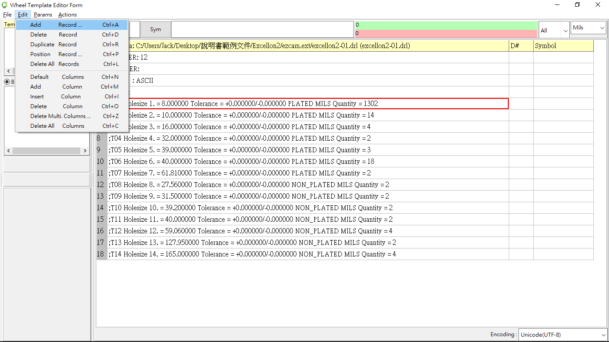

- 由於是鑽孔，所以選擇 "**Hole**"，點選 "**OK**"。

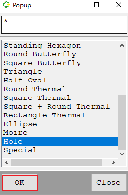

<h4 id="3-2-5"> 3-2-5 設定 Dcode </h4>

- 左邊 Basic 欄必須與右邊欄位數值一致，因此必須與紅框內項目比對相同的 Dcode 數並帶入正確的格式。

- 經比對後可得知，左邊 Basic 欄的 Float 1 即是右方 Dcode 1。
- 點開 Float 改成 **Dcode**。

<h4 id="3-2-6"> 3-2-6 設定尺寸 </h4>

- 左右比對 Size 數值，找到左邊 Basic 欄和右邊 Size 相同的數字，本範例為 8.000000。

- 點選數值左右一致的 Float 欄，然後點擊 "**Diameter**"，系統即會帶入此數值。

<h4 id="3-2-7"> 3-2-7 Translate Wheel </h4>

- 點開 "**Actions**"，選 "**Translate Wheel**"。

- 執行 Translate Wheel 後系統會自動帶入同為 "PLATED" 的項目。

---------------------

<h4 id="3-2-8"> 3-2-8 實作範例延續 </h4>

- 剩餘 "NON-PLATED" 項目作法如同 3-2-4~3-2-7 的操作。

- 選擇第一個還未成為綠底的鑽孔項目。

- 點開 "**Edit**" 選 "**Add Record**"。

- 由於是鑽孔，所以選擇 "**Hole**"，點選 "**OK**"。

- 左邊 Basic 欄必須與右邊欄位一致，因此必須比對相同的數字以帶入正確的格式。

- 經比對後可得知，Hole size 8 即是 Dcode，如果該欄不是 Dcode 請改成 "**Dcode**"。

- 比對後找到相同的 Size，點選 "**Diameter**" 以帶入預設值。

- 設定完形狀、Dcode、Size 後點開 "**Actions**"，然後點選 "**Translate Wheel**"。

<h4 id="3-2-9"> 3-2-9 儲存設定完成的 Wheel Template </h4>

- 確認所有項目都已經設置好 Dcode 和形狀且皆為綠底狀態後，即可儲存 Wheel Template 檔。

- 點開 "**File**"，選 "**Save**" (或按快捷鍵 Ctrl+S)。
- 命名 Wheel Template。

<h4 id="3-2-10"> 3-2-10 讀取設定完成的 Wheel Template </h4>

#####▼ 回到 Input Package 畫面。

- 選擇要 Input 的 Excellon2 檔按右鍵，點選 "**Parameter**"。

- 點選 "**Wheel**"，於 Popup 視窗裡選擇剛剛修改的 Wheel 檔案，此範例即 excellon2-01.drl，點選 "**OK**"。
* File filter 提供快速讀取並帶入其他類似檔案的功能。
	* 請於 Other File 選取 "**Yes**"。
	* Format 選取 "**Same**"。
	* Directory 選取 "**Same**"。
	* 都設定完後請點選 "**OK**"。

<h4 id="3-2-11"> 3-2-11 重新 Translate Excellon2 </h4>

- 勾選需要的 Excellon2 項目。
- 先點選 "**Identify**"，後點選 "Translate" 以重新讀入修正 Wheel Template 後的 Excellon2。

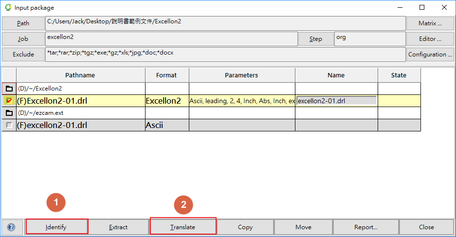

- 跳出的 Warning 視窗會詢問您是否覆蓋選取 Layers 之前的紀錄，這時請選取 "**OK**"。

- 剛才選取的 Excellon2 檔，Translate 執行後會出現綠底狀態，State 欄位會顯示 OK。

- 最後請點選 "**Editor**" 進入編輯畫面檢查鑽孔圖形是否正確讀入。

------------

<h2 id="4-1"> 4-1 讀取 DXF 一般程序 </h2>

- 本章節會以實際範例來說明讀取 DXF 的一般程序。

<h4 id="4-1-1"> 4-1-1 創建 Entity </h4>

- 先點開 "**File**"，再點選 "**Create**"。

- Entity name：輸入 Entity 名稱(通常為料號)。
- Database：選取 Entity 存放的位置。

- 以上設定完後請點選 "**OK**"，跳出的確認通知也點選 "**OK**"。

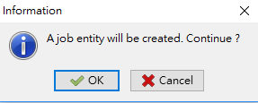

- 完成後 Entity 會出現在 camPro 主畫面上。

- 先點選您要讀取 DXF 的 Entity，進入 Input package 畫面後點選 "**Input**"。

### 讀取 DXF 有兩種方式：

<h4 id="4-1-2"> 4-1-2 一般讀取 </h4>

- 點選 "**Path**"，然後您要讀取的 DXF 資料夾，之後點選 "**Open**"。

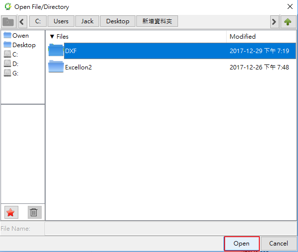

<h4 id="4-1-3"> 4-1-3 拖曳讀取 </h4>
- 將 DXF 資料夾直接拖曳到 camPro 視窗內。

<h4 id="4-1-4"> 4-1-4 分析與處理 DXF </h4>

- 點擊 "**Identify**"，camPro 就會開始分析檔案類型。

 

- 分析完成檔案類型會顯示在視窗裡，並呈現可勾選狀態，請輸入 Step 名稱在欄位裡，範例名稱以 org 為例。

- 請勾選要讀入的 DXF 檔案後點選 "**Translate**"。

- 創建 Step 確認，點選 "**OK**"。

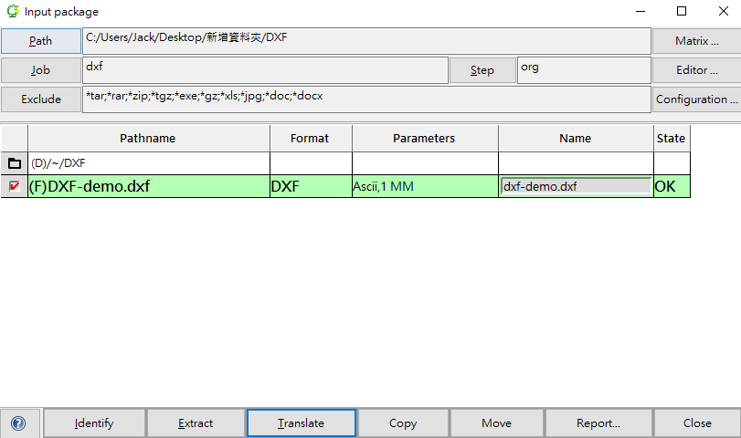

- DXF 檔案經過 Translate 後 State 欄顯示 OK 即表示您的 DXF 已經正常讀取。

- 接下來請點選 "**Editor**"，以檢閱您的 DXF 圖形顯示是否符合預期。

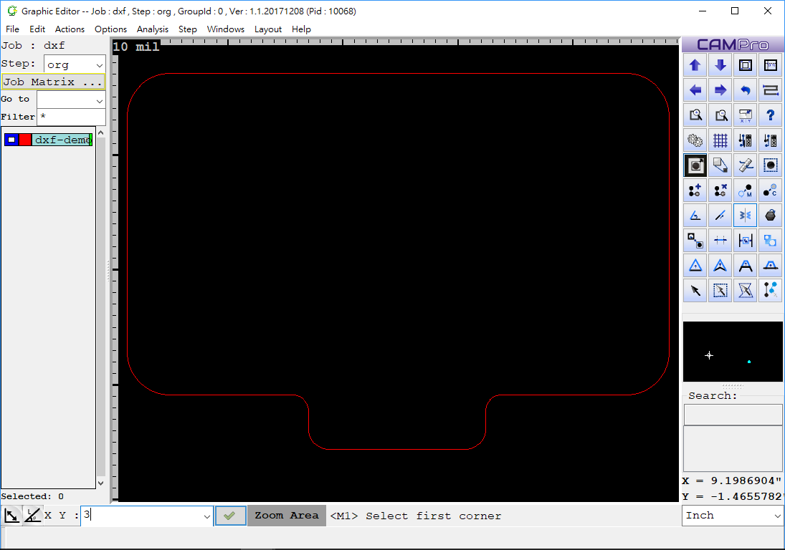

<h2 id="4-2"> 4-2 讀取 DXF 時發生異常時如何處理 </h2>

- 如果您發現您所讀取的 DXF 圖形顯示不符合預期，本章節提供您一些解決方案。

<h4 id="4-2-1"> 4-2-1 如何修正 DXF 參數 </h4>

- 如果遇到 DXF 比例不正確時，請先勾選需要修正的 DXF，然後再點右鍵，點選 "**Parameters**" 以修改參數。

- 依據您的需求，修改參數選項，然後點選 "**OK**"。

<h4 id="4-2-2"> 4-2-2 重新 Translate DXF </h4>

- 更改完成後即可依據修正後的參數再次點選 "**Translate**"。

<h2 id="5-1"> 5-1 匯出 Gerber274X </h2>

- 此章節會以實際範例示範如何匯出 Gerber274X。

<h4 id="5-1-1"> 5-1-1 如何開啟 Output Package 視窗  </h4>

#####開啟 Output 視窗有兩種方式：

a. 點選您要 Output 的 Job 名稱，然後點選 "**Output**"。(本說明以 gerber274x 為例)

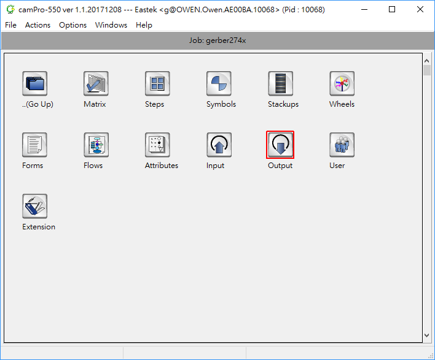

b. 點開 "**Windows**"，點選 "**Output**"。

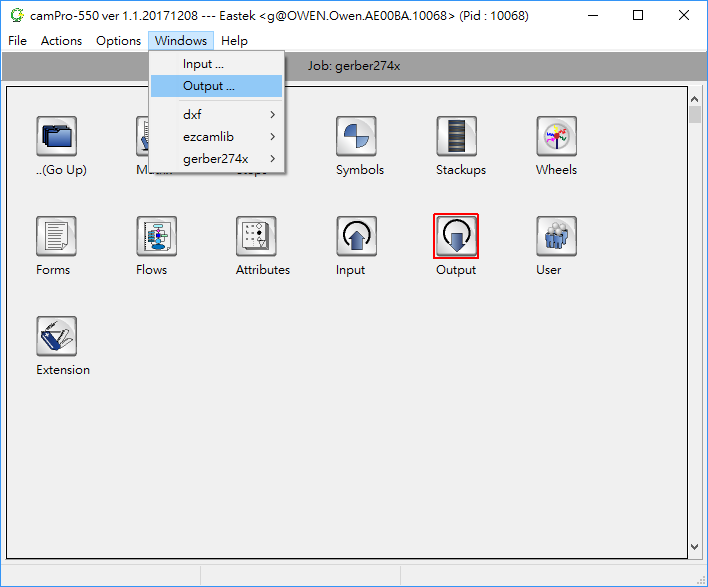

<h4 id="5-1-2"> 5-1-2 選擇需要 Output 的 Job </h4>

- 點選 "**Job**"，選擇您要的匯出的 Job (可複選)，然後點選 "**OK**"。

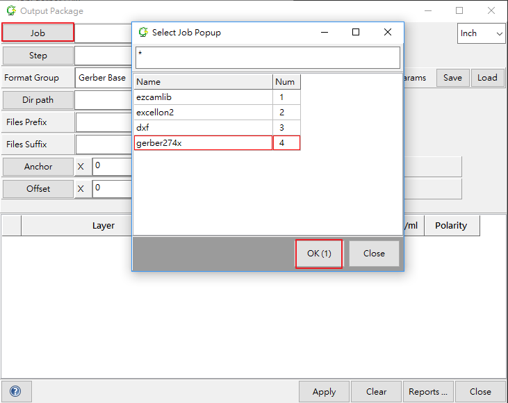

<h4 id="5-1-3"> 5-1-3 選擇需要 Output 的 Step </h4>

- 點選 "**Job**"，選擇您要的匯出的 Step (可複選)，然後點選 "**OK**"。

<h4 id="5-1-4"> 5-1-4 設定 Output 格式 </h4>

- 設定 Format Group：camPro 提供 Gerber Base, Drawing, Drill/Rout, GDSII, CAM System, Netlist 讓您選擇，本說明以選擇 **Gerber Base** 為例，Format 選 **Gerber274x** 為例。

<h4 id="5-1-5"> 5-1-5 選擇需要 Output 的 Layer </h4>

- 您可以任意勾選您需要的 Layer 來匯出，本說明以勾選全部 Layer 為例。
- 如果您只需要部分 Layer，可以針對任一個項目點右鍵，然後點選 "**Layer Filter**" 來做快速篩選您需要的 Layer。

<h4 id="5-1-6"> 5-1-6 設定參數 </h4>

- 點選 "**More**"。

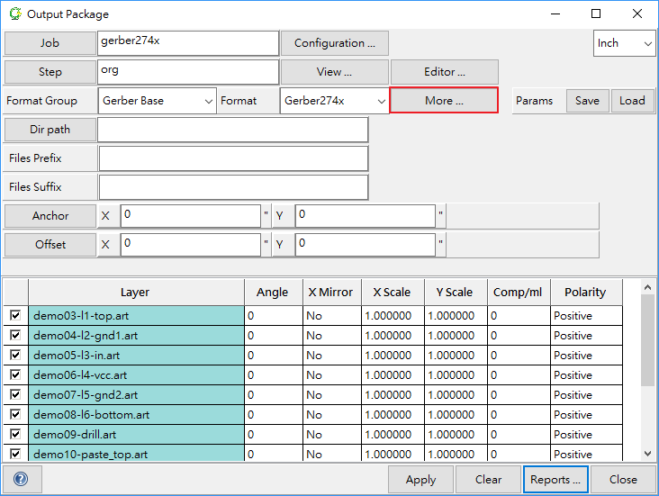

- 點選 "**More**" 後會出現 Output Parameter Popup。

- Break S & R：可選擇是否將排版打散。

- Break Symbols：可選擇是否將 Symbol 打散。

- Break Arcs：可選擇是否將 Arc 打散。

- Scale Mode：漲縮模式設定。

- Surfaces Mode：對 Surface 的描述方式。

- **Contour： 以多邊形方式描述外框，需搭配 Clean Hole overlap 設定多邊形的重疊距離使用**。
- **Fill： 以最小線寬來填滿 Surface，需搭配 Minimal brush 設定填滿多邊形的最小線寬**。

- Unit：單位設定。

- Coordinates：座標設定。
- Absolute:絕對座標 ; Incremental：相對座標。
- Zeroes omitted：是否補零設定 。     
	* None：不補零。                   
    * Leading：前補零。              
    * Trailing：後補零。

- Number format：座標格式設定

※第一個欄位的數值越大則圖形比例越大,反之則越小。                           
※修改圖形比例時原則上兩者數值相加要相同。

- 以上參數設定請依據您的需求做修改，完成後點擊 "**Close**"，回到主畫面。

<h4 id="5-1-7"> 5-1-7 儲存參數設定 </h4>

- 回到 Output Package，點選 "**Save**" 以儲存剛剛的在參數設定所做的修改。
- 儲存之後點選 "**Load**" 即會擷取上一次 Save 的參數設定。

<h4 id="5-1-8"> 5-1-8 選擇 Output 路徑 </h4>

- 點選 "**Dir path**"，選擇要存放的路徑然後按 "**Open**"。(說明以存放路徑 C:/CAMPro/1.1/bin/ 為例)

<h4 id="5-1-9"> 5-1-9 命名 Gerber274X 檔案 </h4>

- File Prefix：主檔名，說明以 Gerber274x-01 為例。
- File Suffix：附檔名後綴名，說明以 .a 為例。

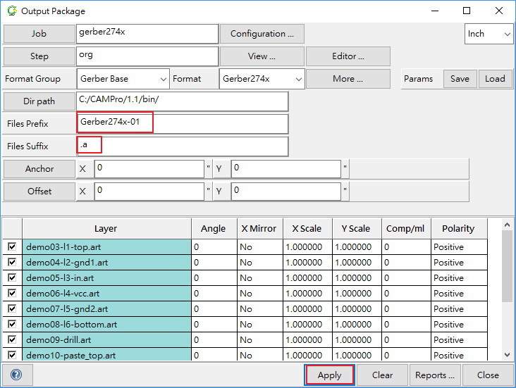

<h4 id="5-1-10"> 5-1-10 選擇定位點 </h4>

- Anchor：漲縮的起始點座標位置，說明以預設值 0 為例。

- Offset：向量方向的位移移動量，說明以預設值 0 為例。

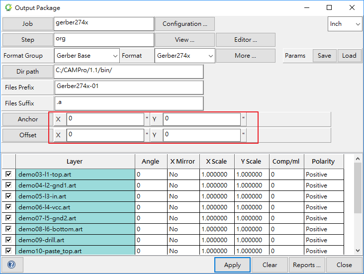

<h4 id="5-1-11"> 5-1-11 Output Gerber274X 完成 </h4>

- 將以上參數設置完成後，點選 "**Apply**" 即可至已設定的 Dir path 路徑找到您 Output 的 Gerber274X 檔案!

<h2 id="5-2"> 5-2 匯出 Excellon2 </h2>

- 此章節會以實際範例示範如何匯出 Excellon2。

<h4 id="5-2-1"> 5-2-1 如何開啟 Output Package 視窗 </h4>

#####開啟 Output 視窗有兩種方式：

a. 點選您要 Output 的 Job 名稱，然後點選 "**Output**"。(本說明以 Excellon2 為例)

b. 點開 "**Windows**"，點選 "**Output**"。

<h4 id="5-2-2">  5-2-2 選擇要 Output 的 Job </h4>

- 點選 "**Job**"，選擇您要的匯出的 Job (可複選)，然後點選 "**OK**"。

<h4 id="5-2-3">  5-2-3  選擇要 Output 的 Step </h4>

- 選擇要 Output 的 Step (可複選)，然後點選 "**OK**"。

<h4 id="5-2-4">  5-2-4  設定 Output 格式 </h4>

- 設定 Format Group：camPro 提供 Gerber Base, Drawing, Drill/Rout, GDSII, CAM System, Netlist 讓您選擇，由於本章節是說明如何匯出鑽孔檔，所以本說明以選擇 **Drill/Rout** 為例，Format 選擇 **Excellon2** 為例。	

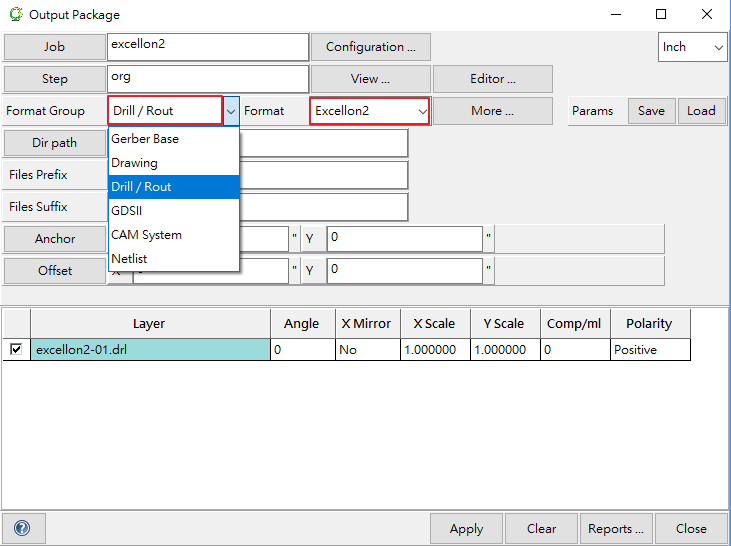

<h4 id="5-2-5">  5-2-5  選擇要 Output 的 Layer </h4>

- 您可以任意勾選您需要的 Layer 來匯出，本說明以勾選 **excellon2-01** 為例。
- 如果您只需要部分 Layer，可以針對任一個項目點右鍵，然後點選 "**Layer Filter**"。

<h4 id="5-2-6">  5-2-6  設定參數 </h4>

- 點選 "**More**"。

- 點選 More 後會出現 Output Parameter Popup。

- Break S & R：可選擇是否將排版打散。

- Break Symbols：可選擇是否將 Symbol 打散。

- Break Arcs：可選擇是否將 Arc 打散。

- Scale Mode：漲縮模式設定。

- Surfaces Mode：對 Surface 的描述方式。

- **Contour：以多邊形方式描述外框,需搭配 Clean Hole overlap 設定多邊形的重疊距離使用**
- **Fill：以最小線寬來填滿 Surface,需搭配 Minimal brush 設定填滿多邊形的最小線寬**。

- Unit：單位設定。

- Coordinates：座標設定。
- Absolute:絕對座標 ; Incremental：相對座標。
- Zeroes omitted：是否補零設定 。     
	* None：不補零。                   
    * Leading：前補零。              
    * Trailing：後補零。

- Number format：座標格式設定

※第一個欄位的數值越大則圖形比例越大,反之則越小。                           
※修改圖形比例時原則上兩者數值相加要相同。

- 以上參數設定請依據您的需求做修改，完成後點擊 "**Close**"，回到主畫面。

<h4 id="5-2-7">  5-2-7  儲存參數設定 </h4>

- 回到 Output Package，點選 "**Save**" 以儲存剛剛的在參數設定所做的修改。
- 儲存之後點選 Load 即會擷取上一次 Save 的參數設定。

<h4 id="5-2-8">  5-2-8  選擇 Output 路徑 </h4>

- 點選 "**Dir path**"，選擇要存放的路徑然後按 "**Open**"。(說明以存放路徑 C:/CAMPro/1.1/bin/ 為例)

<h4 id="5-2-9">  5-2-9 命名 Excellon2 檔案</h4>

- File Prefix：主檔名，說明以 Excellon2-01 為例。
- File Suffix：附檔名後綴名，說明以 .a 為例。

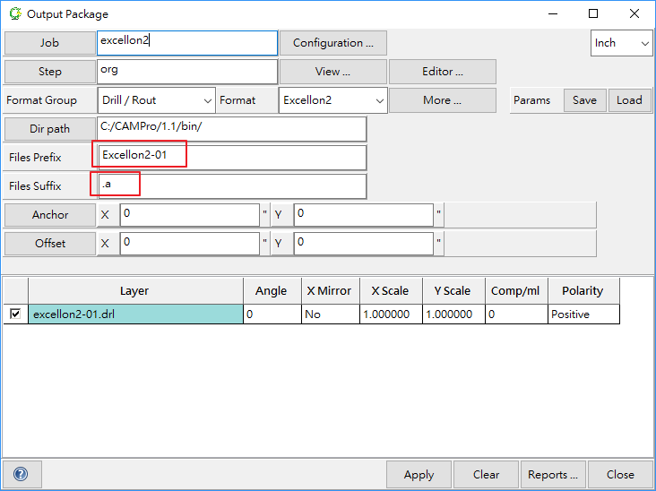

<h4 id="5-2-10">  5-2-10 選擇定位點</h4>

- Anchor：漲縮的起始點座標位置，說明以預設值為例。

- Offset：向量方向的位移移動量，說明以預設值為例。

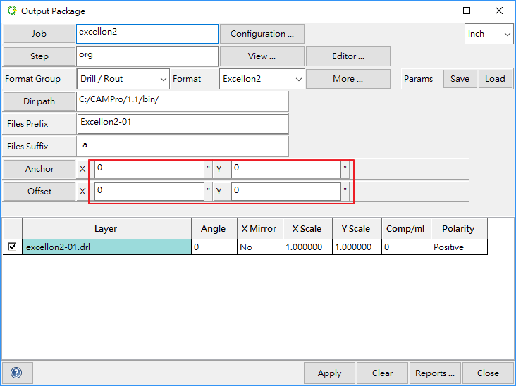

<h4 id="5-2-11"> 5-2-11 Output Excellon2 完成 </h4>

- 將以上參數設置完成後，點選 "**Apply**" 即可至已設定的 Dir path 路徑找到您 Output 的 Excellon2 檔案!

<h2 id="5-3"> 5-3 匯出 DXF </h2>

- 此章節會以實際範例示範如何匯出 DXF。

<h4 id="5-3-1"> 5-3-1 如何開啟 Output Package 視窗  </h4>

#####開啟 Output 視窗有兩種方式：

a. 點選您要 Output 的 Job 名稱，然後點選 "**Output**"。(本說明以名稱為 DXF-demo 為例)

b. 點開 "**Windows**"，點選 "**Output**"。

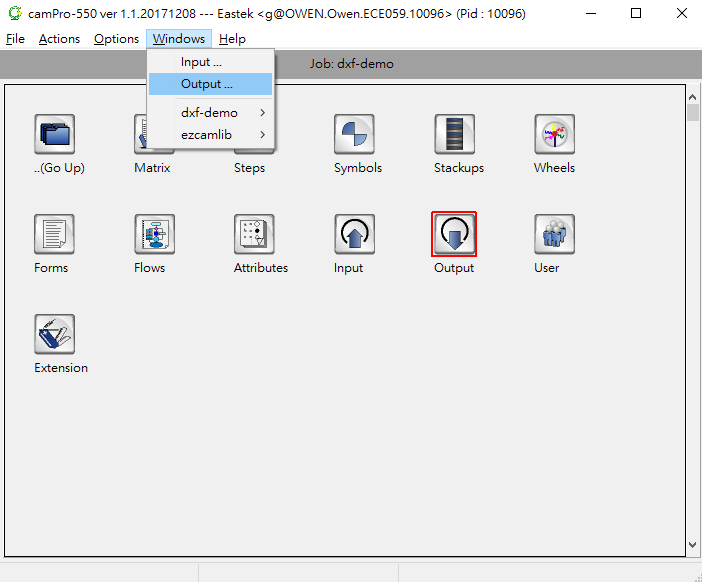

<h4 id="5-3-2">  5-3-2 選擇需要 Output 的 Job  </h4>

- 點選 "**Job**"，選擇您要的匯出的 Job，然後點選 "**OK**"。

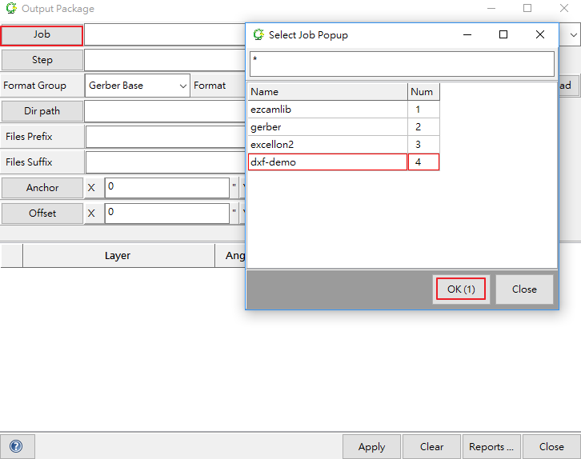

<h4 id="5-3-3"> 5-3-3 選擇需要 Output 的 Step  </h4>

- 點選 "**Step**"，選擇您要的匯出的 "**Step**"，然後點選 "**OK**"。

<h4 id="5-3-4"> 5-3-4 設定 Output 格式  </h4>

- 設定 Format Group：campro 提供 Gerber Base, Drawing, Drill/Rout, GDSII, CAM System, Netlist 讓您選擇。
- 要匯出 DXF 時，Format Group 必須選 Drawing，Format 欄即會帶出 DXF。

<h4 id="5-3-5"> 5-3-5 選擇需要 Output 的 Layer  </h4>

- 您可以任意勾選您需要的 Layer 來匯出，本說明以勾選 dxf-demo 為例。
- 如果您只需要部分 Layer，可以針對任一個項目點右鍵，然後點選 "**Layer Filter**"。

<h4 id="5-3-6"> 5-3-6 設定參數  </h4>

- 點選 "**More**"。

- 點選 More 後會出現 Output Parameter Popup。

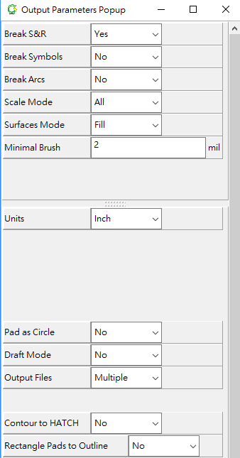

- Break S & R：可選擇是否將排版打散。

- Break Symbols：可選擇是否將 Symbol 打散。

- Break Arcs：可選擇是否將 Arc 打散。

- Scale Mode：漲縮模式設定。

- Surfaces Mode：對 Surface 的描述方式。

- **Contour：以多邊形方式描述外框,需搭配 Clean Hole overlap 設定多邊形的重疊距離使用**。
- **Fill：以最小線寬來填滿 Surface,需搭配 Minimal brush 設定填滿多邊形的最小線寬**。

- Unit：單位設定。

- Pad as Circle：PAD 的型態是否要改以輪廓線方式描述。
  
- Draft Mode：是否要以 0 線寬來描述輪廓線。
  
- Output Files：輸出檔案的型態。
    * Multiple：多層 。
    * Single：單一層別。

- Contour to HATCH：是否要以 Surface 去填滿實心部分。

- Rectangle Pads to outline：Rectangle Pads 是否要以輪廓線方式描述。

- 以上參數設定請依據您的需求做修改，完成後點擊 "**Close**"，回到主畫面。

<h4 id="5-3-7"> 5-3-7 儲存參數設定  </h4>

- 回到 Output Package，點選 "**Save**" 以儲存剛剛的在參數設定所做的修改。
- 儲存以後點選 "**Load**" 即會擷取上一次 Save 的參數設定。

<h4 id="5-3-8"> 5-3-8 選擇 Output 路徑  </h4>

- 點選 "**Dir path**"，選擇要存放的路徑然後按 "**Open**"。(說明以存放路徑 C:/CAMPro/1.1/bin/ 為例)

<h4 id="5-3-9"> 5-3-9 命名 DXF 檔案  </h4>

- File Prefix：主檔名，說明以 dxf01 為例
- File Suffix：附檔名後綴名，說明以 .a 為例

<h4 id="5-3-10"> 5-3-10 選擇定位點  </h4>

- Anchor：漲縮的起始點座標位置，說明以預設值為例。

- Offset：向量方向的位移移動量，說明以預設值為例。

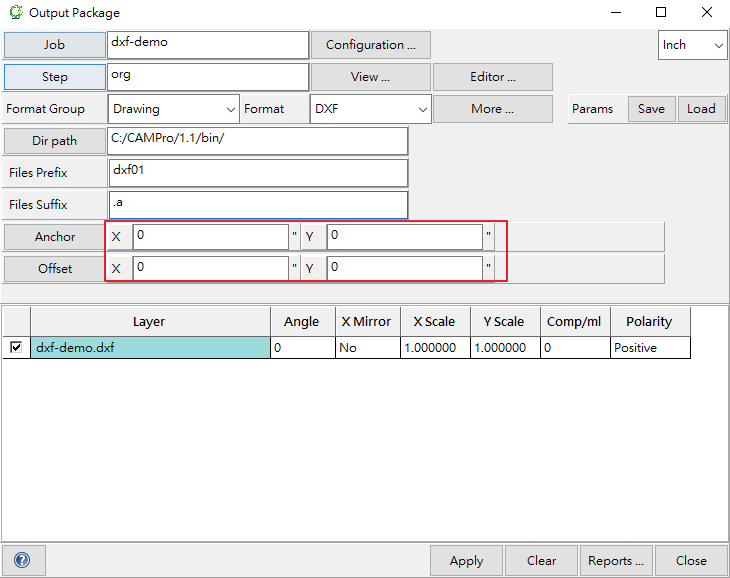

<h4 id="5-3-11"> 5-3-11 Output DXF完成  </h4>

- 將以上參數設置完成後，點選 "**Apply**" 即可至剛才設定的 Dir path 路徑找到您 Output 的 DXF 檔案!

